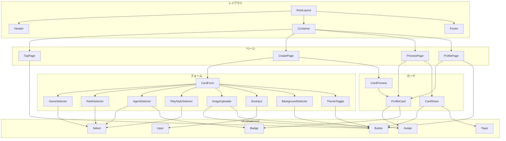

# コンポーネント設計

## 1. コンポーネント一覧

### UI コンポーネント（shadcn/ui）

| コンポーネント名 | 種別 | 説明                   |
| ---------------- | ---- | ---------------------- |
| Button           | ui   | 汎用ボタン             |
| Input            | ui   | テキスト入力           |
| Textarea         | ui   | 複数行テキスト入力     |
| Select           | ui   | セレクトボックス       |
| Label            | ui   | フォームラベル         |
| Card             | ui   | カードコンテナ         |
| Avatar           | ui   | プロフィール画像表示   |
| Badge            | ui   | バッジ（ランク表示等） |
| Toast            | ui   | 通知トースト           |
| Skeleton         | ui   | ローディング表示       |

### 認証コンポーネント

| コンポーネント名 | 種別 | 説明                                        |
| ---------------- | ---- | ------------------------------------------- |
| LoginButton      | auth | ログインボタン（Discord/Google）            |
| LogoutButton     | auth | ログアウトボタン                            |
| AuthGuard        | auth | 認証必須ページのラッパー                    |
| UserMenu         | auth | ユーザーメニュー（アバター+ドロップダウン） |

### レイアウトコンポーネント

| コンポーネント名 | 種別   | 説明                     |
| ---------------- | ------ | ------------------------ |
| Header           | layout | 共通ヘッダー             |
| Footer           | layout | 共通フッター             |
| Container        | layout | コンテンツ幅制限コンテナ |

### カードコンポーネント

| コンポーネント名 | 種別 | 説明                   |
| ---------------- | ---- | ---------------------- |
| ProfileCard      | card | プロフィールカード本体 |
| CardPreview      | card | カードプレビュー表示   |
| CardShare        | card | シェアボタン群         |

### フォームコンポーネント

| コンポーネント名   | 種別 | 説明                       |
| ------------------ | ---- | -------------------------- |
| CardForm           | form | カード作成フォーム全体     |
| GameSelector       | form | ゲーム選択                 |
| RankSelector       | form | ランク選択                 |
| AgentSelector      | form | エージェント選択（複数可） |
| PlayStyleSelector  | form | プレイスタイル選択         |
| ImageUploader      | form | 画像アップロード           |
| SnsInput           | form | SNS ID入力                 |
| BackgroundSelector | form | 背景選択                   |
| ThemeToggle        | form | テーマ切替                 |

### ページコンポーネント

| コンポーネント名 | 種別 | 説明                           |
| ---------------- | ---- | ------------------------------ |
| HeroSection      | page | トップページヒーローセクション |
| FeatureSection   | page | 特徴紹介セクション             |
| ProfileDetail    | page | プロフィール詳細表示           |

## 2. コンポーネント階層図



## 3. 主要コンポーネント詳細

---

### ProfileCard

プロフィールカードの本体。OGP画像生成とPNGダウンロードの両方で使用。

#### Props

```typescript
type ProfileCardProps = {
  data: {
    game: string
    playerName: string
    rank: string
    agents: string[]
    playStyle: string
    bio: string
    xId?: string
    discordId?: string
    profileImage?: string
  }
  background: string
  theme: 'light' | 'dark'
  className?: string
}
```

#### 用途

- カード作成ページのリアルタイムプレビュー
- プレビューページのカード表示
- プロフィールページのカード表示
- OGP画像生成

---

### CardForm

カード作成フォーム全体を管理するコンポーネント。

#### Props

```typescript
type CardFormProps = {
  onSubmit: (data: CardFormData) => void
  onChange?: (data: CardFormData) => void
  initialData?: Partial<CardFormData>
  isSubmitting?: boolean
}

type CardFormData = {
  game: string
  playerName: string
  rank: string
  agents: string[]
  playStyle: string
  bio: string
  xId?: string
  discordId?: string
  profileImage?: string
  background: string
  theme: 'light' | 'dark'
}
```

#### 用途

- カード作成ページで使用
- React Hook Form + Zod でバリデーション管理

---

### CardPreview

カードのリアルタイムプレビュー表示。

#### Props

```typescript
type CardPreviewProps = {
  data: CardFormData
  ref?: React.RefObject<HTMLDivElement>
}
```

#### 用途

- カード作成ページでフォーム横に表示
- ref を渡して html-to-image でキャプチャ可能

---

### CardShare

シェアボタン群（ダウンロード、URLコピー、Xシェア）。

#### Props

```typescript
type CardShareProps = {
  cardId: string
  cardRef: React.RefObject<HTMLDivElement>
  shareText?: string
}
```

#### 用途

- プレビューページで使用
- 各シェアアクションを実行

---

### GameSelector

対応ゲームの選択。

#### Props

```typescript
type GameSelectorProps = {
  value: string
  onChange: (value: string) => void
  error?: string
}
```

#### 用途

- カード作成フォームで使用
- 選択したゲームに応じてランク・エージェントの選択肢が変わる

---

### RankSelector

ランクの選択。ゲームごとに異なるランク体系に対応。

#### Props

```typescript
type RankSelectorProps = {
  game: string
  value: string
  onChange: (value: string) => void
  error?: string
}
```

#### 用途

- カード作成フォームで使用
- game props に応じて選択肢を動的に変更

---

### AgentSelector

メインエージェント/キャラクターの選択（複数可）。

#### Props

```typescript
type AgentSelectorProps = {
  game: string
  value: string[]
  onChange: (value: string[]) => void
  max?: number
  error?: string
}
```

#### 用途

- カード作成フォームで使用
- 最大3体まで選択可能（デフォルト）

---

### ImageUploader

プロフィール画像のアップロード。

#### Props

```typescript
type ImageUploaderProps = {
  value?: string
  onChange: (url: string) => void
  onUpload: (file: File) => Promise<string>
  presets?: { id: string; url: string; label: string }[]
  error?: string
}
```

#### 用途

- カード作成フォームで使用
- アップロードまたはプリセットから選択

---

### SnsInput

SNS ID の入力フィールド。

#### Props

```typescript
type SnsInputProps = {
  platform: 'x' | 'discord'
  value: string
  onChange: (value: string) => void
  error?: string
}
```

#### 用途

- カード作成フォームで使用
- プラットフォームごとに適切なバリデーション

---

### BackgroundSelector

カード背景の選択。

#### Props

```typescript
type BackgroundSelectorProps = {
  game: string
  value: string
  onChange: (value: string) => void
  options: { id: string; url: string; label: string }[]
}
```

#### 用途

- カード作成フォームで使用
- ゲームごとに異なる背景オプション

---

### Header

共通ヘッダー。

#### Props

```typescript
type HeaderProps = {
  showCreateButton?: boolean
}
```

#### 用途

- 全ページ共通で表示
- ロゴ、ナビゲーションを含む

---

### Footer

共通フッター。

#### Props

```typescript
type FooterProps = {}
```

#### 用途

- 全ページ共通で表示
- コピーライト、利用規約リンクを含む

---

## 4. コンポーネント命名規則

| 対象            | 規則                        | 例                        |
| --------------- | --------------------------- | ------------------------- |
| コンポーネント  | PascalCase                  | `ProfileCard.tsx`         |
| Props型         | コンポーネント名 + Props    | `ProfileCardProps`        |
| ディレクトリ    | PascalCase                  | `ProfileCard/`            |
| テストファイル  | コンポーネント名 + .test    | `ProfileCard.test.tsx`    |
| Storiesファイル | コンポーネント名 + .stories | `ProfileCard.stories.tsx` |

## 5. ディレクトリ構成例

```
src/components/
├── ui/                          # shadcn/ui（自動生成）
│   ├── button.tsx
│   ├── input.tsx
│   └── ...
├── card/
│   ├── ProfileCard/
│   │   ├── ProfileCard.tsx
│   │   ├── ProfileCard.test.tsx
│   │   └── ProfileCard.stories.tsx
│   ├── CardPreview/
│   │   └── ...
│   └── CardShare/
│       └── ...
├── form/
│   ├── CardForm/
│   │   └── ...
│   ├── GameSelector/
│   │   └── ...
│   └── ...
└── layout/
    ├── Header/
    │   └── ...
    └── Footer/
        └── ...
```
