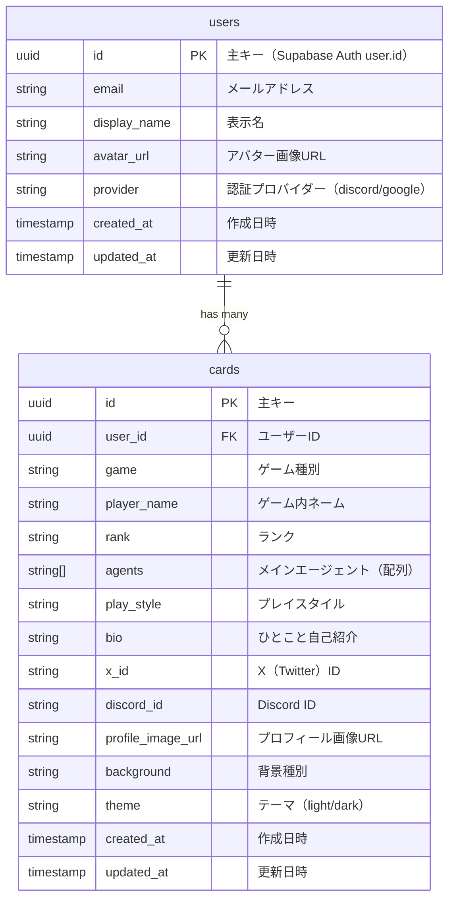

# ER図

## 1. テーブル一覧

### MVP
| テーブル名 | 説明 |
|-----------|------|
| users | ユーザー情報（Supabase Auth連携） |
| cards | プロフィールカード情報 |

※ cardsテーブルにuser_idを持たせ、ユーザーとカードを1:N で紐付け

## 2. ER図

### MVP



## 3. テーブル詳細

### users

ユーザー情報を保存するテーブル。Supabase Authと連携。

| カラム | 型 | NULL | デフォルト | 説明 |
|--------|-----|------|-----------|------|
| id | uuid | NO | - | 主キー（Supabase Auth user.id） |
| email | varchar(255) | NO | - | メールアドレス |
| display_name | varchar(50) | YES | NULL | 表示名 |
| avatar_url | text | YES | NULL | アバター画像URL |
| provider | varchar(20) | NO | - | 認証プロバイダー（discord/google） |
| created_at | timestamptz | NO | now() | 作成日時 |
| updated_at | timestamptz | NO | now() | 更新日時 |

#### インデックス
| インデックス名 | カラム | 種別 |
|---------------|--------|------|
| users_pkey | id | PRIMARY |
| users_email_idx | email | UNIQUE |

---

### cards

プロフィールカードの情報を保存するテーブル。

| カラム | 型 | NULL | デフォルト | 説明 |
|--------|-----|------|-----------|------|
| id | uuid | NO | gen_random_uuid() | 主キー、シェアURLに使用 |
| user_id | uuid | NO | - | ユーザーID（外部キー） |
| game | varchar(50) | NO | - | ゲーム種別（valorant等） |
| player_name | varchar(20) | NO | - | ゲーム内ネーム |
| rank | varchar(50) | NO | - | ランク |
| agents | text[] | NO | - | メインエージェント（配列） |
| play_style | varchar(50) | NO | - | プレイスタイル |
| bio | varchar(100) | YES | NULL | ひとこと自己紹介 |
| x_id | varchar(50) | YES | NULL | X（Twitter）ID |
| discord_id | varchar(50) | YES | NULL | Discord ID |
| profile_image_url | text | YES | NULL | プロフィール画像URL |
| background | varchar(50) | NO | 'default' | 背景種別 |
| theme | varchar(10) | NO | 'dark' | テーマ（light/dark） |
| created_at | timestamptz | NO | now() | 作成日時 |
| updated_at | timestamptz | NO | now() | 更新日時 |

#### インデックス
| インデックス名 | カラム | 種別 |
|---------------|--------|------|
| cards_pkey | id | PRIMARY |
| cards_user_id_idx | user_id | INDEX |
| cards_created_at_idx | created_at | INDEX |

#### 外部キー
| 制約名 | カラム | 参照 |
|--------|--------|------|
| cards_user_id_fkey | user_id | users.id |

---

## 4. Supabase マイグレーション

### MVP用 SQL

```sql
-- users テーブル作成
CREATE TABLE users (
  id uuid PRIMARY KEY REFERENCES auth.users(id) ON DELETE CASCADE,
  email varchar(255) NOT NULL UNIQUE,
  display_name varchar(50),
  avatar_url text,
  provider varchar(20) NOT NULL,
  created_at timestamptz NOT NULL DEFAULT now(),
  updated_at timestamptz NOT NULL DEFAULT now()
);

-- cards テーブル作成
CREATE TABLE cards (
  id uuid PRIMARY KEY DEFAULT gen_random_uuid(),
  user_id uuid NOT NULL REFERENCES users(id) ON DELETE CASCADE,
  game varchar(50) NOT NULL,
  player_name varchar(20) NOT NULL,
  rank varchar(50) NOT NULL,
  agents text[] NOT NULL,
  play_style varchar(50) NOT NULL,
  bio varchar(100),
  x_id varchar(50),
  discord_id varchar(50),
  profile_image_url text,
  background varchar(50) NOT NULL DEFAULT 'default',
  theme varchar(10) NOT NULL DEFAULT 'dark',
  created_at timestamptz NOT NULL DEFAULT now(),
  updated_at timestamptz NOT NULL DEFAULT now()
);

-- インデックス作成
CREATE INDEX cards_user_id_idx ON cards(user_id);
CREATE INDEX cards_created_at_idx ON cards(created_at DESC);

-- RLS（Row Level Security）有効化
ALTER TABLE users ENABLE ROW LEVEL SECURITY;
ALTER TABLE cards ENABLE ROW LEVEL SECURITY;

-- users ポリシー
CREATE POLICY "Users can view own profile"
  ON users FOR SELECT
  USING (auth.uid() = id);

CREATE POLICY "Users can update own profile"
  ON users FOR UPDATE
  USING (auth.uid() = id);

-- cards ポリシー
CREATE POLICY "Cards are viewable by everyone"
  ON cards FOR SELECT
  USING (true);

CREATE POLICY "Users can create own cards"
  ON cards FOR INSERT
  WITH CHECK (auth.uid() = user_id);

CREATE POLICY "Users can update own cards"
  ON cards FOR UPDATE
  USING (auth.uid() = user_id);

CREATE POLICY "Users can delete own cards"
  ON cards FOR DELETE
  USING (auth.uid() = user_id);

-- updated_at 自動更新トリガー
CREATE OR REPLACE FUNCTION update_updated_at()
RETURNS TRIGGER AS $$
BEGIN
  NEW.updated_at = now();
  RETURN NEW;
END;
$$ LANGUAGE plpgsql;

CREATE TRIGGER users_updated_at
  BEFORE UPDATE ON users
  FOR EACH ROW
  EXECUTE FUNCTION update_updated_at();

CREATE TRIGGER cards_updated_at
  BEFORE UPDATE ON cards
  FOR EACH ROW
  EXECUTE FUNCTION update_updated_at();

-- 新規ユーザー作成時に users テーブルに自動挿入
CREATE OR REPLACE FUNCTION handle_new_user()
RETURNS TRIGGER AS $$
BEGIN
  INSERT INTO users (id, email, display_name, avatar_url, provider)
  VALUES (
    NEW.id,
    NEW.email,
    COALESCE(NEW.raw_user_meta_data->>'full_name', NEW.raw_user_meta_data->>'name'),
    NEW.raw_user_meta_data->>'avatar_url',
    NEW.raw_app_meta_data->>'provider'
  );
  RETURN NEW;
END;
$$ LANGUAGE plpgsql SECURITY DEFINER;

CREATE TRIGGER on_auth_user_created
  AFTER INSERT ON auth.users
  FOR EACH ROW
  EXECUTE FUNCTION handle_new_user();
```

## 5. Storage バケット

### profile-images

プロフィール画像を保存するバケット。

| 設定 | 値 |
|------|-----|
| バケット名 | profile-images |
| 公開設定 | Public |
| ファイルサイズ上限 | 5MB |
| 許可形式 | image/jpeg, image/png, image/webp |

#### ポリシー
```sql
-- 誰でもアップロード可能
CREATE POLICY "Anyone can upload profile images"
  ON storage.objects FOR INSERT
  WITH CHECK (bucket_id = 'profile-images');

-- 誰でも閲覧可能
CREATE POLICY "Profile images are publicly accessible"
  ON storage.objects FOR SELECT
  USING (bucket_id = 'profile-images');
```
