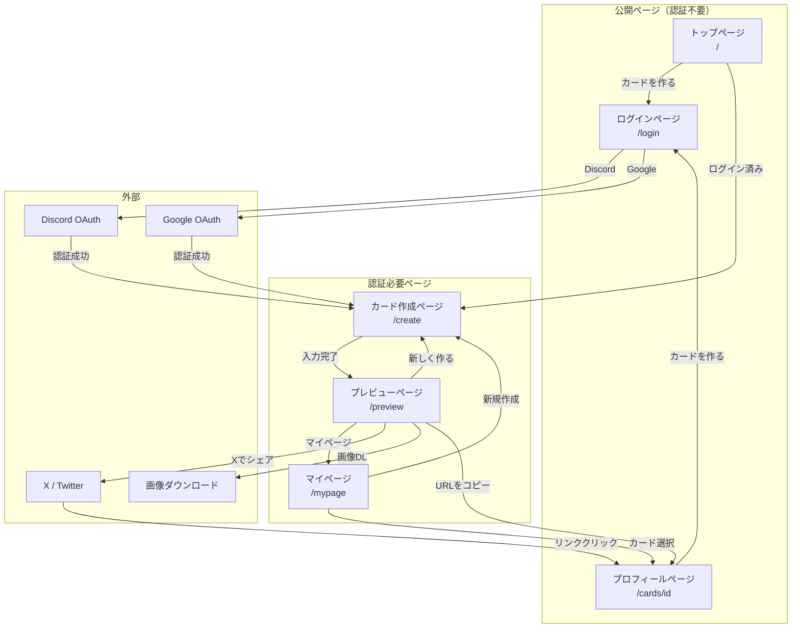

# 画面設計

## 1. 画面一覧

| 画面名             | パス          | 認証     | 説明                               |
| ------------------ | ------------- | -------- | ---------------------------------- |
| トップページ       | `/`           | 不要     | サービス紹介、カード作成への導線   |
| ログインページ     | `/login`      | 不要     | Discord / Google ログイン          |
| カード作成ページ   | `/create`     | **必要** | ゲーム選択〜カード情報入力         |
| プレビューページ   | `/preview`    | **必要** | 作成したカードの確認・保存・シェア |
| マイページ         | `/mypage`     | **必要** | 自分のカード一覧・管理             |
| プロフィールページ | `/cards/[id]` | 不要     | シェアURL先の詳細表示（公開）      |

## 2. 画面遷移図



## 3. 各画面詳細

---

### トップページ（`/`）

#### 目的

- サービスの価値を伝える
- カード作成への誘導

#### 要素一覧

| 要素               | 種類       | 説明                                    |
| ------------------ | ---------- | --------------------------------------- |
| ヒーローセクション | セクション | キャッチコピー、サービス説明、CTAボタン |
| CTAボタン          | ボタン     | 「カードを作る」→ /create へ遷移        |
| 特徴セクション     | セクション | サービスの3つの特徴を紹介               |
| サンプルカード     | 画像       | 作成できるカードのサンプル表示          |
| フッター           | フッター   | コピーライト、利用規約リンク            |

#### ワイヤーフレーム

```
┌─────────────────────────────────────┐
│            Header                   │
├─────────────────────────────────────┤
│                                     │
│         GGprofile                   │
│    ゲーマーのための                  │
│    自己紹介カード                    │
│                                     │
│      [ カードを作る ]               │
│                                     │
├─────────────────────────────────────┤
│  ┌─────┐  ┌─────┐  ┌─────┐         │
│  │特徴1│  │特徴2│  │特徴3│         │
│  │簡単 │  │シェア│  │OGP │         │
│  └─────┘  └─────┘  └─────┘         │
├─────────────────────────────────────┤
│         サンプルカード               │
│        ┌───────────┐               │
│        │   Card    │               │
│        │  Sample   │               │
│        └───────────┘               │
├─────────────────────────────────────┤
│            Footer                   │
└─────────────────────────────────────┘
```

---

### ログインページ（`/login`）

#### 目的

- ユーザー認証
- Discord / Google でログイン

#### 要素一覧

| 要素                  | 種類     | 説明                |
| --------------------- | -------- | ------------------- |
| ロゴ                  | 画像     | GGprofile ロゴ      |
| 説明文                | テキスト | ログインの案内      |
| Discordログインボタン | ボタン   | Discord OAuth認証へ |
| Googleログインボタン  | ボタン   | Google OAuth認証へ  |
| 利用規約リンク        | リンク   | 利用規約ページへ    |

#### ワイヤーフレーム（モバイル）

```
┌─────────────────────────────────────┐
│            Header                   │
├─────────────────────────────────────┤
│                                     │
│         [ GGprofile ロゴ ]          │
│                                     │
│     ログインしてカードを作成        │
│                                     │
│  ┌───────────────────────────────┐ │
│  │  [ Discordでログイン ]        │ │
│  └───────────────────────────────┘ │
│                                     │
│  ┌───────────────────────────────┐ │
│  │  [ Googleでログイン ]         │ │
│  └───────────────────────────────┘ │
│                                     │
│     ログインすると利用規約に        │
│     同意したものとみなします        │
│                                     │
├─────────────────────────────────────┤
│            Footer                   │
└─────────────────────────────────────┘
```

#### 挙動

- ボタン押下でOAuth認証画面へリダイレクト
- 認証成功後、元のページまたはカード作成ページへリダイレクト
- 既にログイン済みの場合はカード作成ページへリダイレクト

---

### カード作成ページ（`/create`）

#### 目的

- プロフィールカードの情報を入力
- リアルタイムでプレビュー確認

#### 要素一覧

| 要素             | 種類           | 説明                                     |
| ---------------- | -------------- | ---------------------------------------- |
| ゲーム選択       | セレクト       | 対応ゲームから選択（初期はVALORANTのみ） |
| プロフィール画像 | アップローダー | 画像アップロードまたはプリセット選択     |
| ゲーム内ネーム   | テキスト入力   | 最大20文字                               |
| ランク           | セレクト       | ゲームごとのランク一覧から選択           |
| メインキャラ     | セレクト       | エージェント/キャラ選択（複数可）        |
| プレイスタイル   | セレクト       | カジュアル/ランク/大会志向など           |
| ひとこと         | テキストエリア | 自己紹介、最大100文字                    |
| X ID             | テキスト入力   | @から始まるID                            |
| Discord ID       | テキスト入力   | username#0000形式                        |
| 背景選択         | ラジオボタン   | プリセット背景から選択                   |
| テーマ           | トグル         | ライト/ダーク                            |
| カードプレビュー | コンポーネント | リアルタイムプレビュー                   |
| 作成ボタン       | ボタン         | カード作成→プレビューページへ            |

#### ワイヤーフレーム（モバイル）

```
┌─────────────────────────────────────┐
│            Header                   │
├─────────────────────────────────────┤
│  カードプレビュー                    │
│  ┌───────────────────────────────┐ │
│  │                               │ │
│  │     [ プレビュー表示 ]         │ │
│  │                               │ │
│  └───────────────────────────────┘ │
├─────────────────────────────────────┤
│  ゲーム                             │
│  [ VALORANT          ▼]            │
│                                     │
│  プロフィール画像                    │
│  [ アップロード ] [ プリセット ]    │
│                                     │
│  ゲーム内ネーム                      │
│  [ __________________ ]             │
│                                     │
│  ランク                             │
│  [ ダイヤモンド2      ▼]            │
│                                     │
│  メインエージェント                  │
│  [ ジェット ][レイナ][+追加]        │
│                                     │
│  プレイスタイル                      │
│  [ ランク           ▼]             │
│                                     │
│  ひとこと                           │
│  [ __________________ ]             │
│  [ __________________ ]             │
│                                     │
│  SNS                                │
│  X: [ @_____________ ]              │
│  Discord: [ ________#____ ]         │
│                                     │
│  背景                               │
│  ○ デフォルト ○ 背景A ○ 背景B     │
│                                     │
│  テーマ                             │
│  [ ダーク ━━●━━ ライト ]           │
│                                     │
│      [ カードを作成する ]           │
│                                     │
├─────────────────────────────────────┤
│            Footer                   │
└─────────────────────────────────────┘
```

#### 挙動

- フォーム入力時にリアルタイムでプレビュー更新
- バリデーションエラーは各フィールド下に表示
- 「カードを作成する」押下でSupabaseに保存→プレビューページへ

---

### プレビューページ（`/preview`）

#### 目的

- 作成したカードの最終確認
- 画像ダウンロード・シェア

#### 要素一覧

| 要素               | 種類     | 説明                              |
| ------------------ | -------- | --------------------------------- |
| 完成カード         | 画像     | 作成されたカード表示              |
| ダウンロードボタン | ボタン   | PNG画像としてダウンロード         |
| URLコピーボタン    | ボタン   | シェアURLをクリップボードにコピー |
| Xシェアボタン      | ボタン   | Twitter Web Intentで投稿画面へ    |
| URLプレビュー      | テキスト | シェアURL表示                     |
| 新しく作るボタン   | ボタン   | /create へ遷移                    |

#### ワイヤーフレーム（モバイル）

```
┌─────────────────────────────────────┐
│            Header                   │
├─────────────────────────────────────┤
│                                     │
│     カードが完成しました！          │
│                                     │
│  ┌───────────────────────────────┐ │
│  │                               │ │
│  │                               │ │
│  │      [ 完成カード表示 ]        │ │
│  │                               │ │
│  │                               │ │
│  └───────────────────────────────┘ │
│                                     │
│  ┌───────────────────────────────┐ │
│  │   [ 画像をダウンロード ]      │ │
│  └───────────────────────────────┘ │
│                                     │
│  ┌───────────────────────────────┐ │
│  │   [ URLをコピー ]             │ │
│  └───────────────────────────────┘ │
│  https://ggprofile.com/cards/xxx   │
│                                     │
│  ┌───────────────────────────────┐ │
│  │   [ Xでシェアする ]           │ │
│  └───────────────────────────────┘ │
│                                     │
│  ──────────────────────────────── │
│                                     │
│       [ 新しいカードを作る ]       │
│                                     │
├─────────────────────────────────────┤
│            Footer                   │
└─────────────────────────────────────┘
```

#### 挙動

- 画像ダウンロード: html-to-imageでPNG生成→ダウンロード
- URLコピー: Clipboard APIでコピー→トースト表示「コピーしました」
- Xシェア: Web Intentで新しいタブ/ウィンドウを開く

---

### プロフィールページ（`/cards/[id]`）

#### 目的

- シェアURLからアクセスした人にカード情報を表示
- カード作成への誘導

#### 要素一覧

| 要素       | 種類       | 説明                                   |
| ---------- | ---------- | -------------------------------------- |
| カード画像 | 画像       | プロフィールカード表示                 |
| 詳細情報   | セクション | ゲーム内ネーム、ランク、エージェント等 |
| SNSリンク  | リンク     | X、Discordへのリンク                   |
| CTAボタン  | ボタン     | 「自分もカードを作る」→ /create        |

#### ワイヤーフレーム（モバイル）

```
┌─────────────────────────────────────┐
│            Header                   │
├─────────────────────────────────────┤
│                                     │
│  ┌───────────────────────────────┐ │
│  │                               │ │
│  │      [ カード表示 ]           │ │
│  │                               │ │
│  └───────────────────────────────┘ │
│                                     │
│  ───── 詳細情報 ─────              │
│                                     │
│  ゲーム: VALORANT                   │
│  ネーム: PlayerName                 │
│  ランク: ダイヤモンド2              │
│  メイン: ジェット、レイナ           │
│  スタイル: ランク                   │
│                                     │
│  ───── ひとこと ─────              │
│  一緒にランク回れる人募集中！       │
│                                     │
│  ───── SNS ─────                   │
│  [ X: @username ]                   │
│  [ Discord: user#1234 ]             │
│                                     │
│  ──────────────────────────────── │
│                                     │
│    [ 自分もカードを作る ]          │
│                                     │
├─────────────────────────────────────┤
│            Footer                   │
└─────────────────────────────────────┘
```

#### 挙動

- OGPメタタグでカード画像を設定（動的生成）
- 存在しないIDの場合は404ページ表示
- SNSリンクは外部サイトへ遷移（新しいタブ）

---

### マイページ（`/mypage`）

#### 目的

- 自分が作成したカードの一覧表示
- カードの管理（削除）

#### 要素一覧

| 要素               | 種類       | 説明                           |
| ------------------ | ---------- | ------------------------------ |
| ユーザー情報       | セクション | アバター、表示名               |
| カード一覧         | グリッド   | 作成したカードのサムネイル一覧 |
| 新規作成ボタン     | ボタン     | /create へ遷移                 |
| カード操作メニュー | メニュー   | 削除、URLコピー                |
| 保存枠表示         | テキスト   | 使用中/上限（例: 2/3）         |

#### ワイヤーフレーム（モバイル）

```
┌─────────────────────────────────────┐
│            Header                   │
├─────────────────────────────────────┤
│                                     │
│  ┌─────┐  ユーザー名                │
│  │ Avatar│ カード: 2/3枚            │
│  └─────┘                            │
│                                     │
│  ┌───────────────────────────────┐ │
│  │   [ 新しいカードを作る ]      │ │
│  └───────────────────────────────┘ │
│                                     │
│  ───── マイカード ─────            │
│                                     │
│  ┌─────────┐  ┌─────────┐          │
│  │ Card 1  │  │ Card 2  │          │
│  │         │  │         │          │
│  │ VALORANT│  │ VALORANT│          │
│  │  [...] │  │  [...] │          │
│  └─────────┘  └─────────┘          │
│                                     │
│  ──────────────────────────────── │
│                                     │
│       [ ログアウト ]               │
│                                     │
├─────────────────────────────────────┤
│            Footer                   │
└─────────────────────────────────────┘
```

#### 挙動

- カードをタップ → プロフィールページへ遷移
- [...] メニュー → URLコピー、削除
- 削除時は確認ダイアログ表示
- 保存枠上限に達している場合は新規作成ボタンを非活性化（無料プラン時）

---

## 4. レスポンシブ対応

### ブレークポイント

| サイズ | 幅       | 対象デバイス       |
| ------ | -------- | ------------------ |
| sm     | 640px〜  | 大型スマートフォン |
| md     | 768px〜  | タブレット         |
| lg     | 1024px〜 | デスクトップ       |

### デバイス別レイアウト

#### カード作成ページ

- **モバイル**: プレビュー上部 + フォーム下部（縦積み）
- **デスクトップ**: フォーム左 + プレビュー右（横並び）

#### プロフィールページ

- **モバイル**: カード上部 + 詳細下部（縦積み）
- **デスクトップ**: カード左 + 詳細右（横並び）
